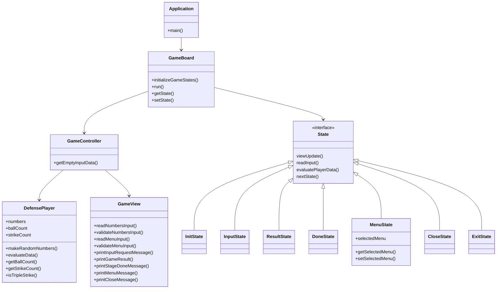

# Class diagram

```mermaid
classDiagram
    Application --> GameBoard
    GameBoard --> GameController
    GameController --> DefensePlayer
    GameController --> GameView

    GameBoard --> State
    State <|-- InitState
    State <|-- InputState
    State <|-- ResultState
    State <|-- DoneState
    State <|-- MenuState
    State <|-- CloseState
    State <|-- ExitState

    class Application {
        +main()
    }
    class GameBoard {
        +initializeGameStates()
        +run()
        +getState()
        +setState()
    }
    class GameController {
        +getEmptyInputData()
    }
    class GameView {
        +readNumbersInput()
        +validateNumbersInput()
        +readMenuInput()
        +validateMenuInput()

        +printInputRequestMessage()
        +printGameResult()
        +printStageDoneMessage()
        +printMenuMessage()
        +printCloseMessage()
    }
    class DefensePlayer {
        +numbers
        +ballCount
        +strikeCount

        +makeRandomNumbers()
        +evaluateData()
        +getBallCount()
        +getStrikeCount()
        +isTripleStrike()
    }
    class State {
        <<interface>>
        viewUpdate()
        readInput()
        evaluatePlayerData()
        nextState()
    }
    class InitState {
    }
    class InputState {
    }
    class ResultState {
    }
    class DoneState {
    }
    class MenuState {
        +selectedMenu
        +getSelectedMenu()
        +setSelectedMenu()
    }
    class CloseState {
    }
    class ExitState {
    }
```
