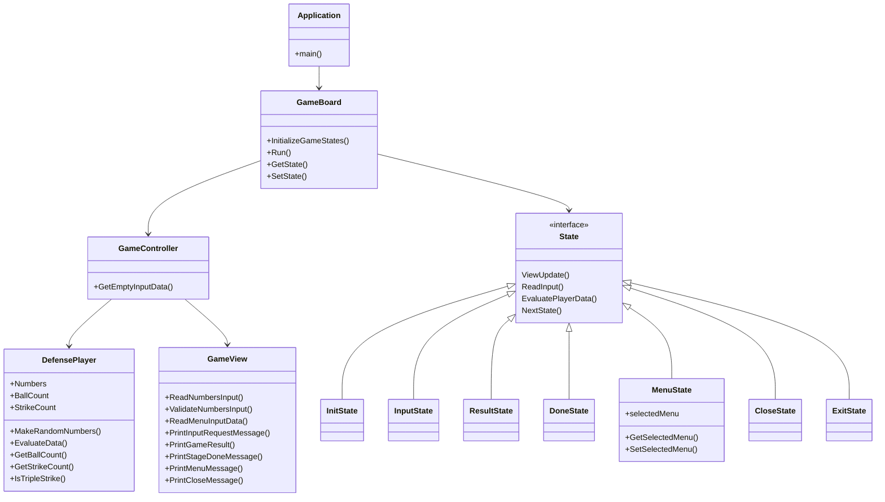

# Class diagram

```mermaid
classDiagram
    Application --> GameBoard
    GameBoard --> GameController
    GameController --> DefensePlayer
    GameController --> GameView

    GameBoard --> State
    State <|-- InitState
    State <|-- InputState
    State <|-- ResultState
    State <|-- DoneState
    State <|-- MenuState
    State <|-- CloseState
    State <|-- ExitState

    class Application {
        +main()
    }
    class GameBoard {
        +InitializeGameStates()
        +Run()
        +GetState()
        +SetState()
    }
    class GameController {
        +GetEmptyInputData()
    }
    class GameView {
        +ReadNumbersInput()
        +ValidateNumbersInput()
        +ReadMenuInputData()

        +PrintInputRequestMessage()
        +PrintGameResult()
        +PrintStageDoneMessage()
        +PrintMenuMessage()
        +PrintCloseMessage()
    }
    class DefensePlayer {
        +Numbers
        +BallCount
        +StrikeCount

        +MakeRandomNumbers()
        +EvaluateData()
        +GetBallCount()
        +GetStrikeCount()
        +IsTripleStrike()
    }
    class State {
        <<interface>>
        ViewUpdate()
        ReadInput()
        EvaluatePlayerData()
        NextState()
    }
    class InitState {
    }
    class InputState {
    }
    class ResultState {
    }
    class DoneState {
    }
    class MenuState {
        +selectedMenu
        +GetSelectedMenu()
        +SetSelectedMenu()
    }
    class CloseState {
    }
    class ExitState {
    }
```
