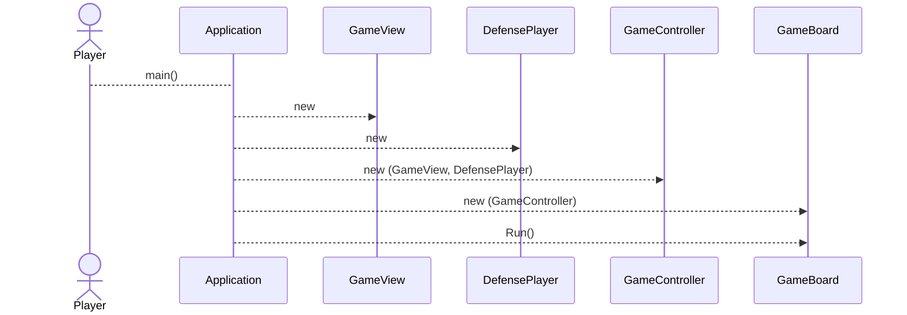
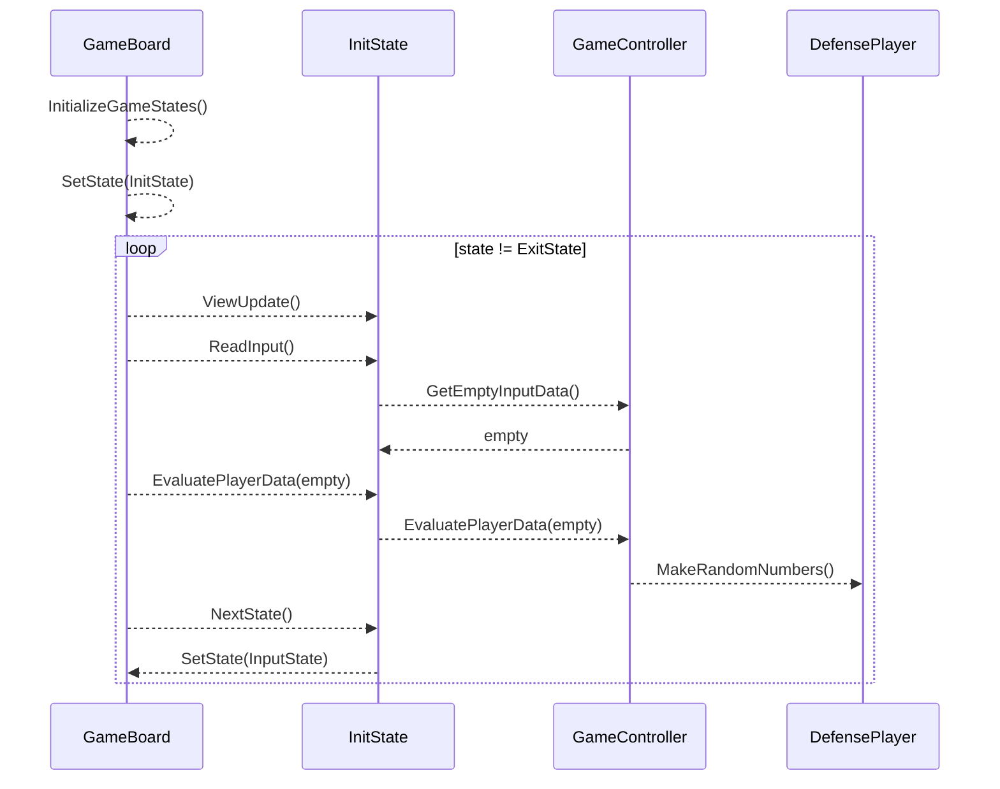
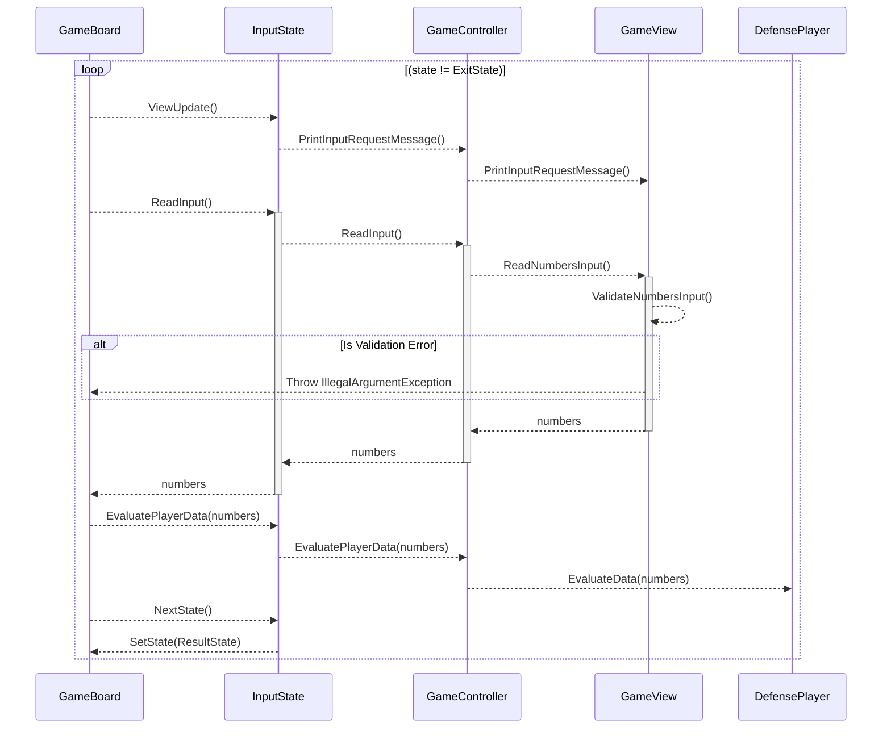
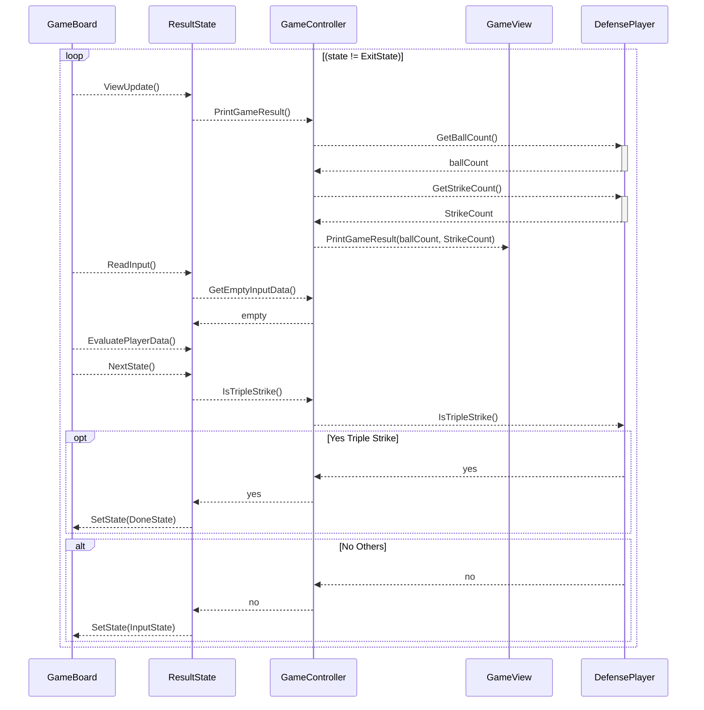
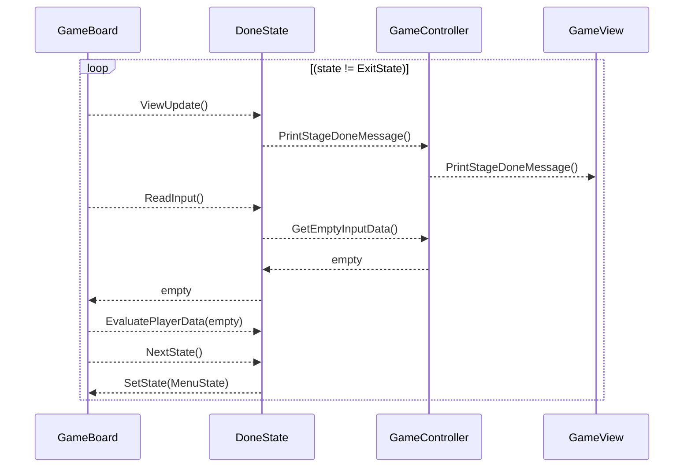
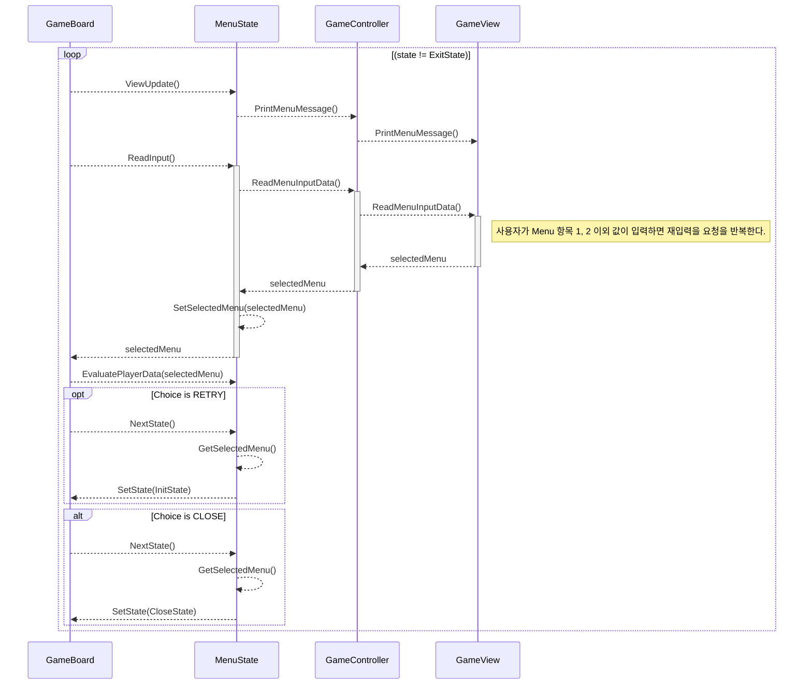
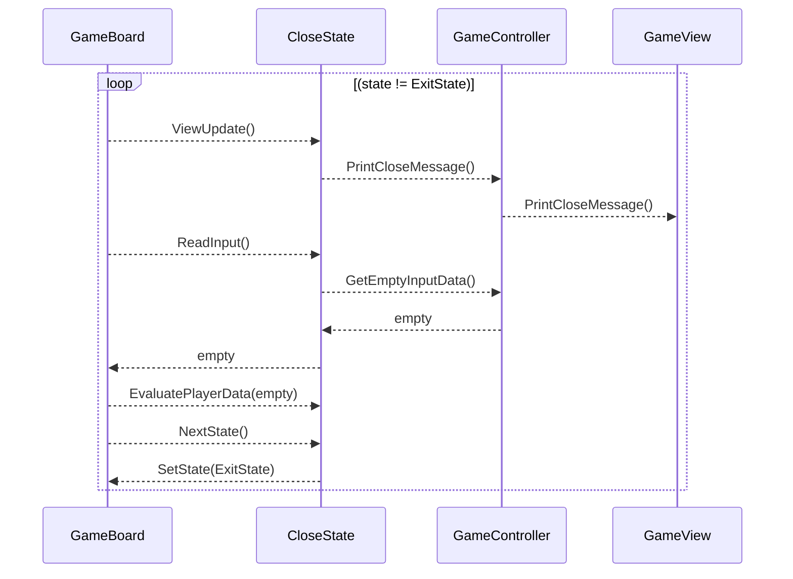

# 시퀸스 다이어그램

## Application.main()

GameBoard 를 초기화하고 게임을 실행한다.

## GameBoard.Run() - INIT

**Init 게임 상태**일 때 수행하는 과정을 설명합니다.

게임 상태 객체를 준비하고 초기 게임 상태로 상태를 설정하고 게임 동작을 반복한다.

✔️ Application 에서 `Run()` 요청한 부분은 생략합니다.

## GameBoard.Run() - INPUT

**Input 게임 상태**일 때 수행하는 과정을 설명합니다.

공격 게임 플레이에게 입력 메시지를 표시하고 숫자를 입력받는다. 받은 숫자를 수비 플레이어에게 전달하여 숫자 비교 판정을 수행합니다.

✔️ Application 에서 `Run()` 요청한 부분은 생략합니다.

## GameBoard.Run() - RESULT

**Result 게임 상태**일 때 수행하는 과정을 설명합니다.

수비 플레이어가 비교 판정한 결과를 화면에 표시합니다.

판정한 결과가 3 스트라이크이면 스테이지 완료 상태(DoneState)로 설정합니다.  
그 외 결과이면 다시 사용자 입력을 받는 입력 상태(InputState)로 설정합니다.

✔️ Application 에서 `Run()` 요청한 부분은 생략합니다.

## GameBoard.Run() - DONE

**Done 게임 상태**일 때 수행하는 과정을 설명합니다.

공격 플레이어가 3 스트라이크로 결과를 맞춰서 축하 메시지와 해당 스테이지를 종료하는 메시지를 화면에 표시합니다.

✔️ Application 에서 `Run()` 요청한 부분은 생략합니다.

## GameBoard.Run() - MENU

**Menu 게임 상태**일 때 수행하는 과정을 설명합니다.

공격이 성공하여 스테이지가 끝나 재시작할 지 게임을 종료할 지 메시지를 화면에 표시합니다.

사용자 선택이 재시작이면 게임 초기 상태(InitState)로 설정합니다.  
다른 선택인 게임 종료라면 게임 닫는 상태(CloseState)로 설정합니다.

✔️ Application 에서 `Run()` 요청한 부분은 생략합니다.

## GameBoard.Run() - CLOSE

**Close 게임 상태**일 때 수행하는 과정을 설명합니다.

사용자가 진행 여부 메뉴에서 게임 종료를 선택하여 게임 종료 메시지를 화면에 표시합니다.

게임 흐름을 종료하려고 게임 종료 상태(ExitState)로 설정합니다.

✔️ Application 에서 `Run()` 요청한 부분은 생략합니다.

