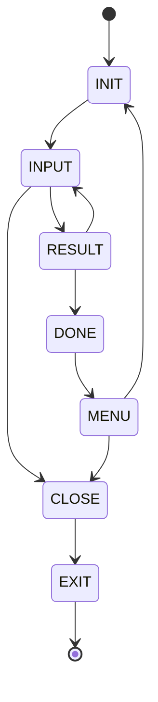

# 상태 다이어그램

7가지 게임 상태를 정의하고 상태 흐름을 구성합니다.

**상태 설명**

| 상태     | 설명                              |
|--------|---------------------------------|
| INIT   | 게임 초기 상태                        |
| INPUT  | 공격 플레이어로부터 숫자 입력을 요청하는 상태       |
| RESULT | 입력된 숫자를 비교 판정하고 결과를 출력하는 상태     |
| DONE   | 결과가 3스트라이크로 축하메시지를 출력하는 상태      |
| MENU   | 스테이지가 끝나 다시 시작할지 게임을 종료할지 묻는 상태 |
| CLOSE  | 게임을 닫는 메시지를 출력하는 상태             |
| EXIT   | 게임을 종료하는 상태                     |

